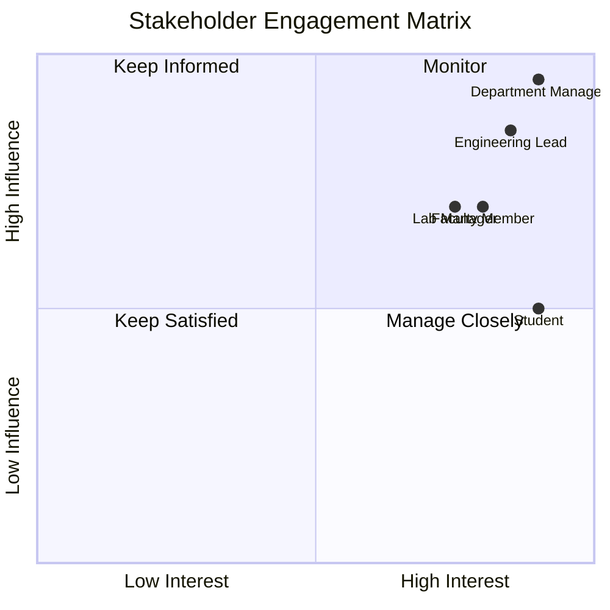

# Departmental SoD Management System - Stakeholder Analysis

## Stakeholder Categories

### Primary Stakeholders
| Stakeholder | Role | Key Expectation |
|---|---|---|
| Students (SoD) | Daily duty execution | Automated scheduling, easy swapping, and accurate bill tracking. |
| Faculty Members | Task requestors | Reliable student assistance and easy verification of completed tasks. |
| Lab Managers | Duty supervisors | Real-time visibility of lab coverage and student attendance. |
| Department Managers | Financial approvers | Accurate monthly bills and clear audit trails for budget management. |

### Secondary Stakeholders
| Stakeholder | Role | Key Expectation |
|---|---|---|
| Academic Registry | Schedule providers | Proper handling of academic timetable data (via IRAS). |

### Internal Stakeholders
Engineering (Backend/Frontend), QA, UX/UI Design, Product Management.

### External Stakeholders
University Administration (for billing compliance), IRAS Data Providers (raw text source).

## Stakeholder Influence-Interest Matrix
| Stakeholder | Influence | Interest |
|---|---|---|
| Department Manager | High | High |
| Faculty Member | Medium | High |
| Lab Manager | Medium | High |
| Student | Medium | High |
| Engineering Lead | High | High |
| Academic Registry | Low | Medium |

## Engagement Strategy

## RACI Matrix
| Deliverable | Dept Manager | Faculty | Lab Manager | Student | BA/Product | Engineering | QA |
|---|---|---|---|---|---|---|---|
| PRD | A | C | C | I | R | C | C |
| SRS | A | C | C | I | R | C | C |
| IRAS Parser Design | I | I | I | C | C | A/R | C |
| Task Dashboard | I | R | R | R | C | A/R | C |
| Swap Proxy Engine | I | I | I | R | C | A/R | C |
| Bill Approval Workflow | A | R | I | I | C | A/R | C |
| Final Signoff | A | C | C | I | I | I | I |

**Legend:** R = Responsible, A = Accountable, C = Consulted, I = Informed.
