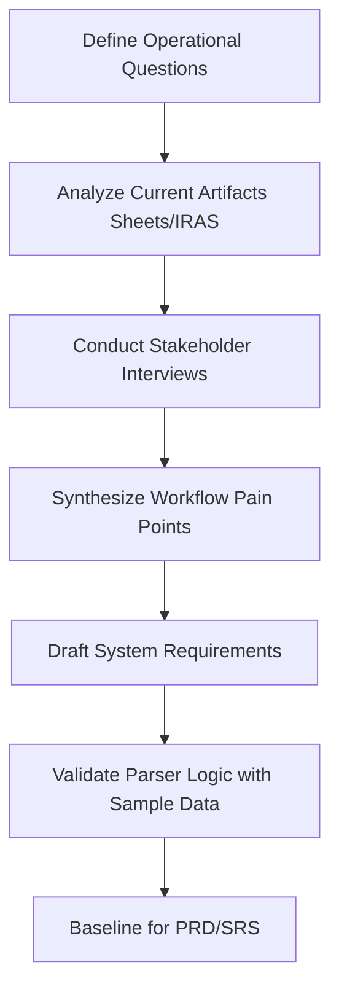

# Departmental SoD Management System - Information Gathering Report

## Why Information Gathering Is Necessary
The success of the SoD Management System depends on accurately capturing the nuances of departmental duties and academic schedule constraints. This phase was essential to ensure that the IRAS parser, the shift-swapping logic, and the bill approval pipeline meet the real-world operational needs of the Department of Physical Science.

## Requirement Elicitation Goals
| Goal ID | Goal |
|---|---|
| EG-01 | Understand the specific duty types (Lab, Faculty, Exam) and their unique requirements. |
| EG-02 | Analyze the raw IRAS schedule format to design an accurate parser. |
| EG-03 | Map the current manual bill approval process to a digital workflow. |
| EG-04 | Identify the common causes of scheduling conflicts and shift-swapping failures. |

## Methodology Used
| Method | Target Group | Purpose | Output |
|---|---|---|---|
| Interviews | Students, Faculty, Lab Managers | Qualitative insights into daily friction points. | Persona maps, pain point analysis. |
| Document Analysis | Google Sheets, IRAS exports | Structural analysis of current data and schedules. | Data schema, parser logic requirements. |
| Observation | Monthly billing cycle | Verification of approval steps and verification needs. | Workflow diagram for bill pipeline. |
| Surveys | 50+ SoD Students | Quantitative data on shift-swapping frequency and availability. | Feature prioritization for proxy engine. |

## Elicitation Process

## Key Findings
| Finding ID | Finding | Requirement Implication |
|---|---|---|
| IF-01 | Students often forget to check timetable changes, leading to no-shows. | Automated IRAS parser and real-time conflict alerts. |
| IF-02 | Faculty members find it hard to track if a student actually completed a task. | Task completion logs and faculty verification step. |
| IF-03 | Shift swapping is delayed because students don't know who is available. | Broadcast Proxy Engine with availability filtering. |
| IF-04 | Bill approvals are delayed by missing documentation/proof of duty. | Mandatory audit trail and image/log attachments for bills. |
| IF-05 | Exam duties have different priority and timing rules than regular lab duty. | Specialized Exam Slot Management module. |

## Requirement Themes
1. **Automation:** Schedule parsing and conflict detection.
2. **Coordination:** Intelligent shift swapping and broadcast alerts.
3. **Accountability:** Verified task completion and multi-stage approvals.
4. **Visibility:** Centralized dashboards and visual schedule exports.

## Outcome
The findings from this elicitation phase directly informed the design of the core modules: Parser, Dashboard, Proxy Engine, and Approval Pipeline, ensuring high alignment with departmental goals.
