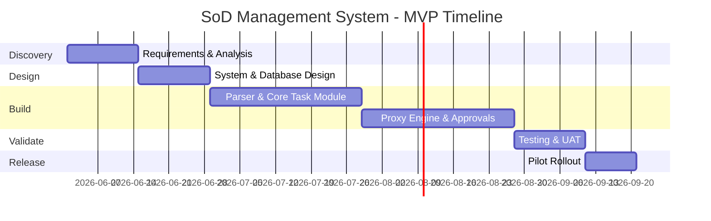

# Departmental SoD Management System - Feasibility Analysis

## Feasibility Summary
| Dimension | Status | Conclusion |
|---|---|---|
| Technical | Feasible | Parser logic and proxy engine are implementable with FastAPI/React. |
| Economic | Feasible | High ROI through administrative time savings and error reduction. |
| Operational | Feasible | Departmental staff and students are eager for a digital solution. |
| Legal | Feasible | Requires data privacy controls for student academic schedules. |
| Schedule | Feasible | MVP deliverable within one academic semester (16 weeks). |
| Risk | Manageable | Primary risks (parser accuracy, user adoption) have mitigation plans. |

## Technical Feasibility
- **Frontend:** React (TypeScript) is ideal for complex dashboards and interactive schedule views.
- **Backend:** Python FastAPI provides the speed and type safety needed for the parser and approval logic.
- **Database:** PostgreSQL is highly suitable for the relational nature of duties, users, and approval chains.
- **Parser Engine:** Regular expressions and structured text parsing can reliably handle raw IRAS text data.
- **Deployment:** Dockerization ensures consistent environments across development and departmental servers.

## Economic Feasibility
### Cost Estimate (Year 1)
| Cost Component | Estimated Cost (USD/Equiv) |
|---|---|
| Development & Design | 15,000 |
| Hosting & Infrastructure | 1,200 |
| Training & Documentation | 800 |
| Maintenance & Support | 2,000 |
| **Total** | **19,000** |

### Benefit Estimate (Year 1)
| Benefit Component | Estimated Value (USD/Equiv) |
|---|---|
| Admin time saved (Scheduling) | 12,000 |
| Admin time saved (Billing) | 8,000 |
| Reduction in billing errors/overpayment | 3,000 |
| Improved student productivity/satisfaction | Intangible (High) |
| **Total** | **23,000** |

**Net Benefit:** Positive ROI within the first year.

## Operational Feasibility
| Area | Readiness | Notes |
|---|---|---|
| Student Readiness | High | Students are digital-native and dissatisfied with current tools. |
| Faculty Readiness | Medium | Requires a very simple, low-friction approval UI. |
| Management Support | High | Department heads are actively seeking to resolve billing disputes. |

## Legal Feasibility
1. **Data Privacy:** Student academic schedules (IRAS) must be treated as sensitive data.
2. **Financial Audit:** The system must maintain immutable logs for bill approvals to satisfy university audit requirements.
3. **User Consent:** Explicit consent for schedule parsing must be captured during onboarding.

## Schedule Feasibility

## Conclusion
The Departmental SoD Management System is highly feasible. The technical risks are focused on the parser's robustness, which can be mitigated with extensive test cases. The operational and economic benefits far outweigh the development costs.
