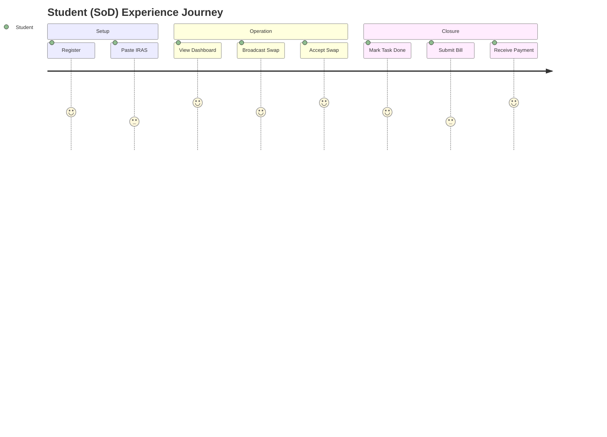

# Departmental SoD Management System - User Journey Map

## Journey Stages
Onboarding -> Schedule Setup -> Task Discovery -> Swap Negotiation -> Task Execution -> Billing & Payment

## End-to-End Journey Table
| Stage | User Goal | User Actions | System Response | Pain Risk | Opportunities |
|---|---|---|---|---|---|
| Onboarding | Create account and set role | Register with Dept ID; select role | Validate ID; set permissions | Incorrect role assignment | Integration with Dept database |
| Schedule Setup | Sync academic timetable | Paste raw IRAS text | Parse text; generate availability grid | Parser errors on new formats | Manual override / "Edit Mode" |
| Task Discovery | See assigned duties | View personal dashboard | Show Lab/Faculty/Exam tasks | Missing tasks / hidden views | Priority highlighting for today |
| Swap Negotiation | Replace a conflicting shift | Trigger "Swap Broadcast" | Identify free students; send alerts | No one accepts the swap | Incentivized swapping / urgency flags |
| Task Execution | Confirm completion | Click "Mark Done"; add log | Record time; notify requestor | Forgotten check-ins | Geo-fenced or QR-based check-in |
| Billing | Get approved for payment | Review monthly summary; submit | Route to Faculty then Dept Manager | Delayed approval by Faculty | Automatic reminders for approvers |

## Experience Heatmap

## Key Journey Improvements
1. **Remove the Manual Bridge:** The IRAS parser removes the most painful step of comparing schedules.
2. **Standardize Communication:** The Proxy Engine replaces 20+ WhatsApp messages with a single system broadcast.
3. **Formalize the "Done" State:** Immediate task logging reduces memory-related disputes during the billing phase.
4. **Visual Reference:** Providing a 1-click image export of the schedule allows students to keep a "lock screen" reference, reducing missed duties.
