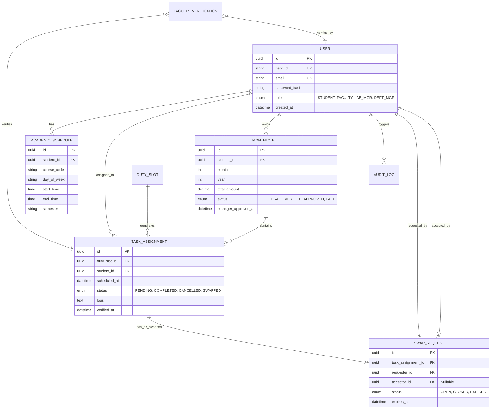

# Departmental SoD Management System - Entity Relationship Diagram (ERD)

## Entity Overview
| Entity | Purpose |
|---|---|
| **User** | Central identity record with role and Department ID. |
| **AcademicSchedule** | Parsed course slots for a student. |
| **DutySlot** | Recurring or one-off duty templates (e.g., "Monday Lab Duty"). |
| **TaskAssignment** | Specific instance of a duty assigned to a student on a specific date. |
| **SwapRequest** | Record of a broadcasted swap request and its resolution. |
| **MonthlyBill** | Aggregated financial record for a student for a specific month. |
| **AuditLog** | Immutable record of critical changes and approvals. |

## Mermaid ER Diagram (Relational)

## Relationship Rules
1. A **User** can have multiple **AcademicSchedule** entries (one for each class).
2. A **TaskAssignment** represents a specific day/time a student is on duty.
3. A **SwapRequest** links a task to a requester and eventually an acceptor.
4. **MonthlyBill** is the financial container for all **Completed** tasks in a billing cycle.
5. **AuditLog** (not pictured in detail) tracks all state transitions in the billing and swap processes.
