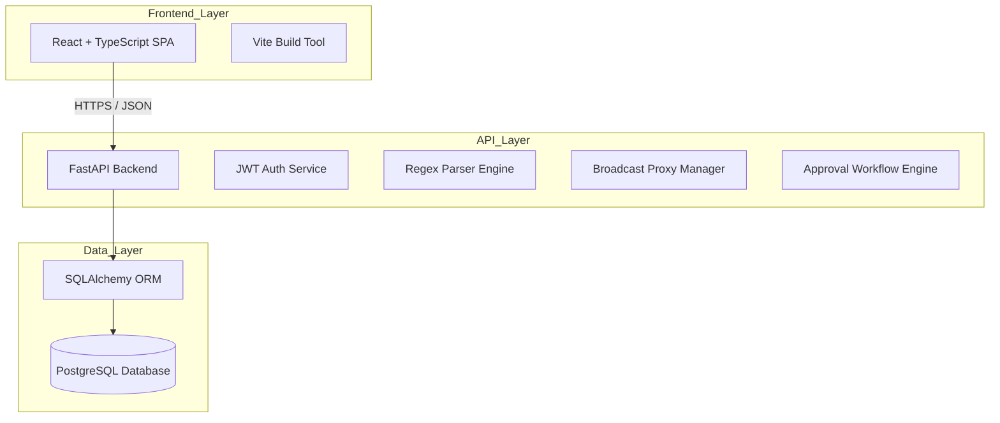

# Departmental SoD Management System - System Design

## High-Level Architecture
The SoD Management System follows a classic 3-tier architecture designed for robustness, security, and ease of deployment within a departmental network.

## Component Breakdown

### 1. Presentation Layer (Frontend)
- **Framework:** React 18+ with TypeScript.
- **State Management:** React Context or Redux Toolkit (for global task states).
- **Styling:** Vanilla CSS or Tailwind (based on repo preference).
- **Features:** 
  - Availability Grid Component.
  - Duty Dashboard with real-time status updates.
  - Image Export utility (using `html2canvas` or similar).

### 2. Application Layer (Backend)
- **Framework:** FastAPI (Asynchronous Python).
- **Modules:**
  - **Auth:** Handles registration, login, and role-based dependency injection.
  - **Parser Module:** Core logic for converting raw IRAS text into time slots.
  - **Proxy Engine:** Calculates candidate lists for swaps by querying availability vs. class schedules.
  - **Billing Service:** Aggregates task hours and applies departmental rates.

### 3. Data Layer (Persistence)
- **Database:** PostgreSQL (Relational).
- **ORM:** SQLAlchemy with Alembic for migrations.
- **Key Schemas:** Users, Schedules, Tasks, Swaps, Bills.

## Security Controls
| Layer | Mechanism |
|---|---|
| Transport | Forced HTTPS (TLS 1.2+). |
| Identity | Short-lived JWT Access Tokens + HttpOnly Refresh Cookies. |
| Access | Role-based Access Control (RBAC) enforced at API endpoints. |
| Data | Password hashing with Argon2id; Financial audit logs. |

## Deployment Strategy
- **Containerization:** Docker Compose for multi-container setup (Web, API, DB).
- **Environment:** Departmental server or local workstation during pilot.
- **CI/CD:** GitHub Actions for automated linting, type-checking, and unit tests.

## Data Flow: Shift Swap
1. Student requests swap via UI.
2. Backend queries `AcademicSchedule` and `TaskAssignment` tables to find students who are "FREE".
3. Backend filters the list and emits an in-app notification.
4. Acceptor confirms; Backend uses a **Postgres Transaction** to update `TaskAssignment.student_id` and log the swap.
