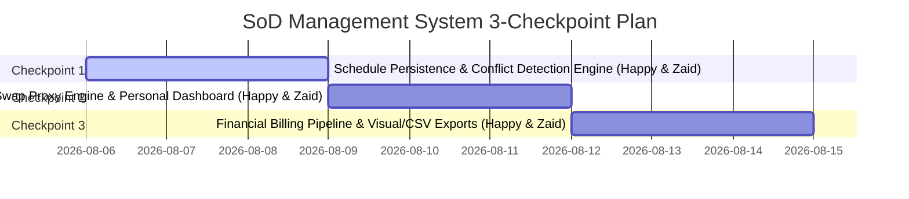

# Departmental SoD Management System - Project Overview & Work Distribution Plan

## Executive Project Overview

The **Departmental SoD (Student on Duty) Management System** is a specialized web platform for the Department of Physical Science designed to automate student duty tracking, task assignments, shift swapping, and monthly bill processing.

### Key Modules & Requirements (from Docs):
1. **Identity & Role-Based Access Control (RBAC):** Student (SoD), Faculty, Lab Manager, Department Manager.
2. **IRAS Schedule Engine:** Raw text schedule parser, availability visualization, unavailable slot overrides, and conflict detection.
3. **Task & Duty Orchestration:** Lab Duty, Exam Invigilation, and Faculty Research assignments with real-time personal dashboards.
4. **Broadcast Proxy Engine:** Shift swap broadcasting, availability-based matching, and swap audit logging.
5. **Financial Billing Approval Pipeline:** Multi-stage approval (Student Draft -> Faculty Verification -> Manager Approval) with real-time earnings tracking.
6. **Reporting & Exports:** 1-Click visual schedule PNG export, CSV payroll reports, and immutable audit logs.

---

## Current Progress & Completed Work

Based on repository history and merged Pull Requests on `main`:
- **Completed (Issues #30, #31, #32, #33):** Frontend scaffold (Vite + React + TS + Tailwind) & Backend API scaffold (FastAPI + Pydantic).
- **Completed (Issue #34 / PR #35):** Core IRAS schedule parser algorithm (`/api/schedule/parse`).
- **Completed (Issue #36 / PR #37):** User Management & Auth System (JWT Authentication, User Registration/Login, User Directory, RBAC Matrix).

---

## 3-Checkpoint Work Distribution (Happy & Zaid)

Both team members (**Happy** and **Zaid**) will work on **both Frontend and Backend (Full Stack)** across all 3 checkpoints, enforcing REST API best practices and full CRUD operations.

---

### Checkpoint 1: Academic Schedule Persistence & Conflict Detection Engine

* **Task 1.1 (Happy - Full Stack): Schedule Storage & Unavailable Overrides**
  - **Backend:** Create `ScheduleService` and CRUD REST endpoints:
    - `POST /api/v1/schedule/save` - Save student's parsed IRAS schedule.
    - `GET /api/v1/schedule/me` - Retrieve current student's academic schedule.
    - `GET /api/v1/schedule/student/{id}` - Manager/Faculty view of student schedule.
    - `POST /api/v1/schedule/unavailable` - Add manual unavailable time slots (`FR-PARSER-03`).
  - **Frontend:** Connect IRAS Parser to save schedules. Build an interactive Weekly Schedule Grid on Student Profile with a manual "Mark Unavailable" toggle.

* **Task 1.2 (Zaid - Full Stack): Automated Conflict Detection Engine**
  - **Backend:** Build automated conflict check logic cross-referencing assigned task dates/times against saved class schedules and unavailable slots. Update `POST /api/v1/tasks` to return conflict alerts or HTTP 409 status (`FR-TASK-03`, `UC-03`).
  - **Frontend:** Update Faculty Task Assignment interface to query student availability in real-time and display warning alerts before duty creation.

---

### Checkpoint 2: Shift Swap Proxy Engine & Personal Dashboard

* **Task 2.1 (Happy - Full Stack): Shift Swap Operations & Availability Validation**
  - **Backend:** Implement RESTful CRUD endpoints for `SwapRequest`: `GET /api/v1/tasks/swaps`, `POST /api/v1/tasks/swaps`, `POST /api/v1/tasks/swaps/{id}/accept`, `GET /api/v1/tasks/swaps/eligible`. Add validation to prevent accepting swaps during class or existing duties (`FR-PROXY-01`, `FR-PROXY-02`).
  - **Frontend:** Connect `Dashboard.tsx` into `App.tsx` as the landing workspace. Build the interactive Shift Swap Broadcast Feed with "Accept Swap" actions.

* **Task 2.2 (Zaid - Full Stack): Swap Audit Log & Dashboard Metrics**
  - **Backend:** Create `AuditLog` service logging swap transaction history (requester, acceptor, task ID, timestamp) and add `GET /api/v1/tasks/swaps/history` (`FR-PROXY-04`).
  - **Frontend:** Add real-time metric cards (assigned duties, pending hours, estimated earnings, open swaps) and Swap Audit History table to the Dashboard.

---

### Checkpoint 3: Financial Billing Pipeline & Visual/CSV Exports

* **Task 3.1 (Happy - Full Stack): Multi-Stage Monthly Billing Pipeline**
  - **Backend:** Create `MonthlyBill` CRUD models and endpoints: `GET /api/v1/bills/my-current`, `POST /api/v1/bills/submit`, `GET /api/v1/bills/pending`, `POST /api/v1/bills/{id}/verify`, `POST /api/v1/bills/{id}/approve` (`FR-BILL-01` to `FR-BILL-04`).
  - **Frontend:** Build the **Billing & Approvals** tab. Student view (earnings summary & submit bill button), Faculty view (task verification checklist & verify button).

* **Task 3.2 (Zaid - Full Stack): Financial Approvals, Payroll CSV & Schedule PNG Exports**
  - **Backend:** Add CSV export service `GET /api/v1/export/report/csv` and schedule export metadata `GET /api/v1/export/schedule/image` (`FR-EXPORT-01`, `FR-EXPORT-02`).
  - **Frontend:** Manager View (verified bill approvals & "Download Payroll CSV" button). Add 1-Click "Export Visual Schedule PNG" feature to the Schedule/Dashboard page.

---

## GitHub Collaboration & Branching Guidelines

1. **Issue Creation:** First, create a detailed GitHub issue (`.github/ISSUES/#issue_num-description.md` and GitHub issue) outlining objectives, acceptance criteria, and task checklist.
2. **Branch Naming:** Create a feature branch starting with `#issue_num` under username namespace: `#issue_num-username-description` or `username/#issue_num-description` (e.g., `#38-happy-schedule-persistence`).
3. **Commit Convention:** Prefix commits with the issue number (e.g. `[#38] Add schedule CRUD REST endpoints`).
4. **Pull Request (PR):** Submit a detailed PR referencing the issue (e.g. `Closes #38`).
5. **Merge Permission:** BEFORE merging any PR to the `dev` branch, **ASK FOR EXPLICIT PERMISSION FROM USER**.
6. **Cleanup:** Once merged to `dev`, close the issue and delete the feature branch.
